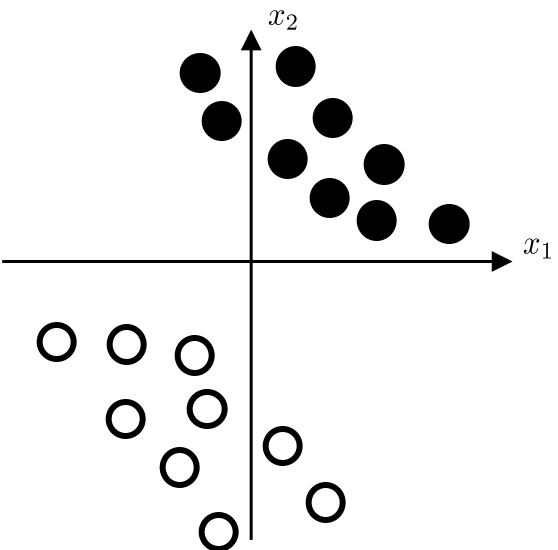
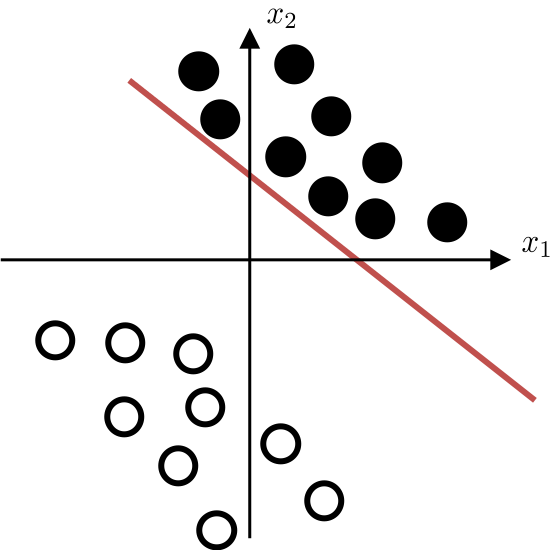
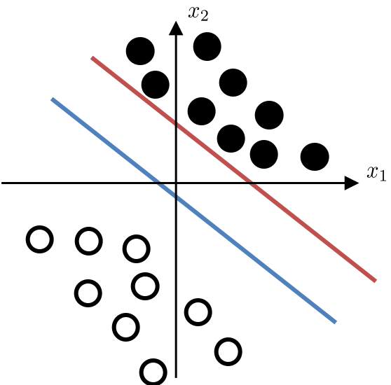
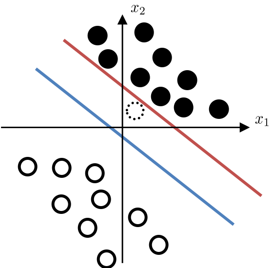
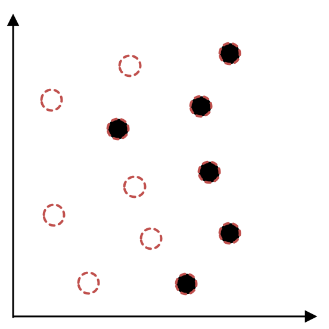
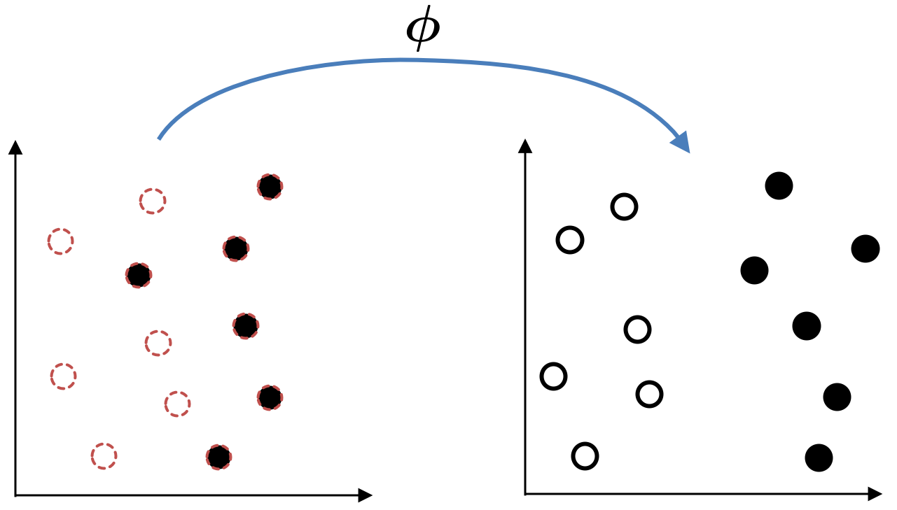
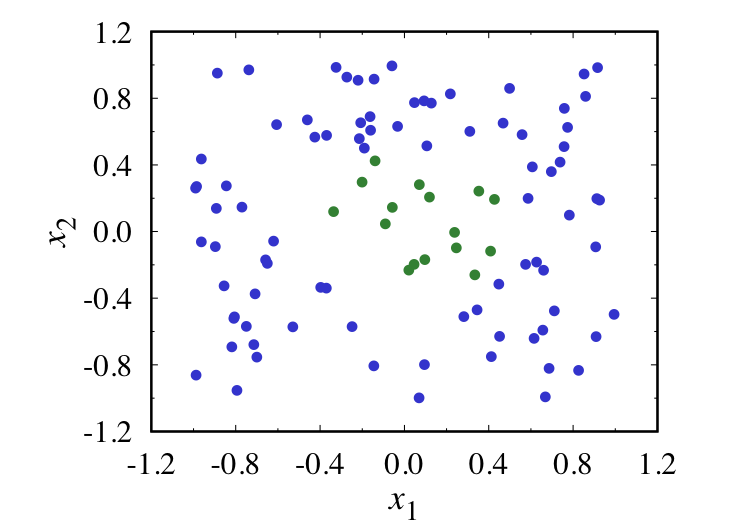
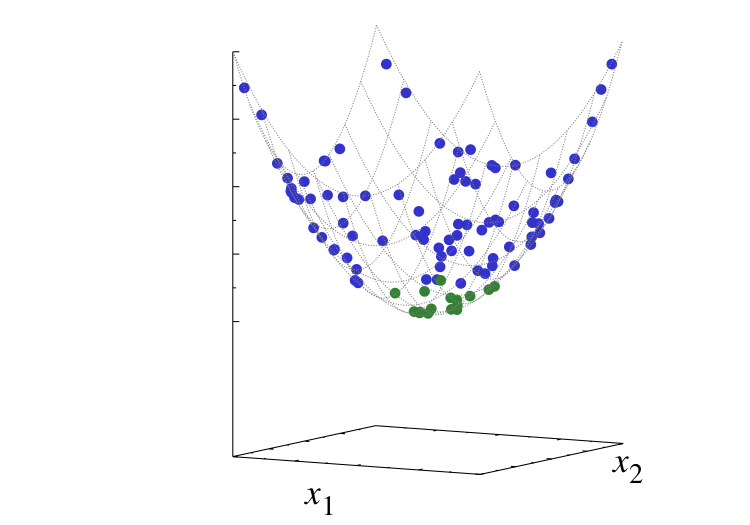

# 事前学習その１: 識別の考え方とSVM

### 識別の基本
識別の問題は，機械学習では「教師あり学習」と呼ばれる問題のひとつです．入力データが数値や画像で与えられて，出力データが「クラスＡ」「クラスＢ」などの離散的な分類で与えられた時に，入力データからその分類をあてる，つまり「識別する」という問題です．このような識別をする機械（識別器と呼ばれます）を一回作ってしまえば，新しい入力データが与えられた時に，それがどの分類に属しているのかを予想することができます．この予想をどのように活かすかがポイントで，応用ごとに頭をひねる必要がありますが，ここではそこまでは立ち入らずに，データから「学ぶ」，つまりデータが持つ構造を引っ張り出すところまでを考えましょう．

画像データであれば，この画像は「猫」，この画像なら「犬」のように分類する問題や，郵便番号の識別の際に手書きの数字から「０」〜「９」をあてる問題などを考えることができます．ただ，識別の方法の基本を理解しやすくするために，ここでは数値データを２つのクラスに識別する問題を考えましょう．



上の図のように横軸と縦軸の２つの特徴量をもつデータがあったとします．例えば横軸を数学の点数，縦軸を理科の点数と考えてみます．原点は０点ではなく，平均点などだと考えておいてください．◯と●はそれぞれ理系クラスと文系クラスを表すものとしましょう．綺麗に分かれすぎていますが，理系クラスのほうが数学も理科もどちらも点数が高い傾向が出ています（あくまでも例ですので，実際にこうだとは思っていません．文系クラスでも数学が得意な人はいますから）．

それでは，数学の点数と理科の点数だけが与えられたとして，その学生が理系クラスか文系クラスか，どちらかをあてたい，としましょう．そのためには理系クラスと文系クラスをうまく分類するような，つまり識別するような「特徴」を見つける必要があります．そこにデータ解析の方法を使えるわけです．

***
### 直線を用いた識別

識別の問題の基本は「直線でデータを分ける」というものです．先ほどのデータ点の図で◯と●を分ける直線を求められれば，新しいデータが来た時に，それがどちら側にあるかによって◯か●かを決めることができます．識別の基本はこれだけで，あとはデータから直線を求めればよいわけです．つまり，下の図のような直線を見つけることが目標になります．



この直線で，◯と●とがきちんと分類されています．

ここで，少し数学を使ってみましょう．まず，入力が２つありますので，２つの入力をもつ関数として以下のものを考えます．


*w*<sub>1</sub>，*w*<sub>2</sub>，そして *b* がパラメータです．これらのパラメータを調節してデータを識別する関数を作ります．

高校の数学レベルで大丈夫ですが，数学では関数は「値」を返します．その「値」を元にしてデータを識別する方法にも色々なものが考えられますが，ここでは「関数の符号」をもとに２つのクラスにわける方法を採用してみましょう．関数の出力が「正の値」であれば理系クラス，「負の値」であれば文系クラス，のような感じです．符号で分けますので，そのちょうど境目に当たるのは関数の値がゼロになるところ，すなわち以下の数式で与えられるところになります．


この数式を式変形すると，以下の式が得られます．


さて，これは何を意味するのでしょうか？ ここで高校で習う直線の方程式を思い出してみます．


直線の方程式として，このような数式を見た覚えがありますよね？ 上の式変形で得られた式は *x*<sub>2</sub> を *y* 軸方向として考えれば，まさに直線の方程式になっています．

以上の手順で，2次元空間を二つに分ける直線を求められました．3次元空間の場合には「平面」が求まります．4次元以上だと人間には想像できなくなってしまいますが，この場合には「超平面 (hyperplane)」と呼ばれるものが求まります．

***
### 「ちょうどいい直線」とは何か？

上に書いたように，直線や平面で識別する，ということが基本です．先ほどの図をもう一度見てみましょう．


きちんとこの直線でデータを二つに分類できていますが，それでは下の図はいかがでしょうか？



赤い線と青い線のどちらの直線も◯と●をきちんと分類できています．その意味では「識別する」という目的を達成できているように思えます．

さて，先に進む前に少し考えてみてください．上の図で，どちらの直線のほうが「良い識別をできる」と思いますか？

「良い識別」とは何か，という基準が定まらないと，実はこの問いかけには答えようがありません．手元にあるデータをわけられればいいという基準であれば，どちらの直線も「良い識別」です．

さて，データを解析する際に忘れてはいけないことは，手元にあるデータは「たまたま」自分が入手しただけ，ということです．例えば先ほどの試験の例で，とりあえず入手できるデータをプロットしたものが先ほどの図だったとしましょう．実は一人分のデータを入力し忘れていて，追加したら下のような図になったとします．


真ん中あたりの，点線で書かれた点が新しいデータです．この新しい点が，◯か●か，どちらのものかを当てるのが必要な仕事ですが，どちらに分類するのがよいでしょうか？ ・・人間ならぱっと見るだけでどちらが良さそうか，わかりますよね．

さて，それでは新しいデータ点を先ほどの二つの直線の図に重ねてみます．



こうすればどちらの直線のほうがよかったか，わかりますね．新しいデータ点は●として考えるべきですが，赤い直線を使ってしまうと，この新しいデータ点を◯と分類してしまいます．ですので，青い直線のほうがよい，ということになります．

手元にあるデータだけではない，ということを意識しておくことは本当に大切です．機械学習では，未知のデータ，これから来るデータにどう対応するかが大切です．手元のデータは訓練データであって，学習のために使うものに過ぎません．本当に大切なのはこれから来るデータへの対応能力です（汎化能力，汎化性能などと呼ばれます）．データマイニングでは手元にあるデータを分析して重要な要因を引っ張り出したり，現象について考察したりするのが目的ですが，それでも手元にあるデータは全体のごく一部，という意識を持っておかないと，おかしな結論を導いてしまうかもしれません．

回帰のところで出てきた「過学習」というのも本質はこれです．データがたくさんあればきちんとした回帰ができるところを，データ数が少ないのにフィットさせようとするからおかしなことになります．だから何かしらの事前知識を使って関数の形を制限したり，正則化の方法を使う必要があるわけですね．

「データの扱いは慎重に」「手持ちのデータが全てではない」という意識は持っておきましょう．

***
### サポートベクトルマシン

識別の方法には色々なものがあります．まずは高性能で有名なものをひとつ紹介しておきます．それがサポートベクトルマシン (Support Vector Machine) です．基本的な考え方は「できるだけ中間の位置で識別をする」というものです．「いい具合のところ」という感じですね．

・・説明がこれだけか，と思われるかもしれませんが，サポートベクトルマシンの本質（のひとつ）はこれだけです．

もちろん本当はこれを数学的に書く必要があります．直線からデータ点までの距離を計算できるので，直線から一番近くにある◯と●を探して，それらとの距離が最大になるように，つまり中間になるように，直線の位置を調整する，という感じです．このあたりは各自で調べてみてください．

***
### 直線以外での識別

回帰の時と同様，データが必ずしも直線で分類できるとは限りません．そういう時の対処方法のひとつは，データを変換することです．

下の図を見てください．



これを直線で分けることはできるでしょうか？

ここで「何らかの数学的な変換」を導入して，例えば下の図のように変換できたとすれば，直線で分類できますよね？



もしくは，こんなデータを考えてみましょう．



これもやはり直線での分類は不可能です．先ほどの例では「何らかの数学的な変換」と書いたのですが，今回は具体的に「次元を増やす」変換を導入してみます．つまりもともとのデータは2次元のものですが，これを3次元空間に写します．



お椀型の局面を考えて，そこに2次元のデータを貼り付けたと考えてください．こうすると次元がひとつ増えますよね．もちろんこれを「直線」で分けるということはできませんが，3次元空間では「直線」の代わりに「平面」で分けます．高校の数学で平面の方程式を習いますが，その方程式（数式）は2次元平面での直線の方程式の拡張になっています（ぜひ，復習を！）．ですので「平面」も非常に扱いやすいものです．上の図のように変換されていれば，平面を使ってデータを分類できますよね．

ちなみに，3次元空間においてお椀を横切る「平面」を2次元に戻すと，曲線（円）になります（頭の中でイメージしてみてください！）．そうするともともとのデータをきちんと分類できるな，ということもわかると思います．

さて，サポートベクトルマシンについては前述しましたが，非常に簡単な説明のみでした．「できるだけ中間の位置で」のようにざっくりとした説明だけでしたが，もちろんそれだけではありません．数式で色々と考えていくと，実はサポートベクトルマシンはこのようなデータの変換と非常に相性が良いことがわかっています．カーネルトリックと呼ばれる方法を使うことで，非常に柔軟に識別する曲線を得ることができることがわかっています．サポートベクトルマシンの本質は直線で分けることなのですが，データを変換してから直線で分けることで，結果として曲線を得られることに注意しておきましょう．これらは発展的な話ですので必要に応じて各自で調べてください．

さらには実はどのような空間を使って直線でわけるかを知る必要がないというメリットもあります．これがメリットなのかどうかはプログラムの中身を書く立場にならないとわかりづらいと思いますが，本当に強力な方法です．そして，使うだけなら，非常に簡単に使えます．このあたりは演習で．

***
### 解析するデータセット

ここでは，[iris data（外部リンク）](https://archive.ics.uci.edu/ml/datasets/Iris) を使います．

「iris」というのは「アヤメ」のことです．アヤメにもいろいろな品種がありますが，
そのうちの3品種「setosa・versicolor・virginica」について，

- 「sepal length」すなわち「がく片の長さ」
- 「sepal width」すなわち「がく片の幅」
- 「petal length」すなわち「花びらの長さ」
- 「petal width」すなわち「花びらの幅」

の4項目を，各品種50ずつ集めたデータから「iris data」は構成されています．

上述のURLから入手できるデータは
```python
5.1,3.5,1.4,0.2,Iris-setosa
4.9,3.0,1.4,0.2,Iris-setosa
4.7,3.2,1.3,0.2,Iris-setosa
4.6,3.1,1.5,0.2,Iris-setosa
...（略）
```
のようなもので，カンマで区切られているのでCSVファイル形式として扱えます．最後の部分がアヤメの品種を表すラベルで，このままPythonで扱うこともできるのですが，数値データだけのほうが扱いやすいので，ここでは数値データに置き換えたものを使います．

[>> iris.csv](./iris.csv)

わかりやすくするために見出しもつけました．

***
### 学習とテストの切り分け

コード [`svm_training.py`](./svm_training.py) を開いてみましょう（また別タブなどで）．またコードを眺めて，何をしているかを推測してみてください．

学習をしている部分は18行目と19行目の
```python
clf = svm.LinearSVC()
clf.fit(training_inputs, training_labels)
```
で，`clf` (classificationからとった，こちらで勝手につけた変数名です．もちろん変更可能) をサポートベクトルマシンとして設定して使いますよ，ということを宣言しています．そして実際に入力と出力データを使って学習 (fit) しているわけです．つまり学習の本質は2行だけ，ということです．

コードの他の部分はファイルの読み込みとデータの整形です．データの整形部分がかなり理解しづらいと思いますが，演習で試しつつ，わからない部分をweb等で調べつつ，頑張って読み取ってください．

さて，コード [`svm_training.py`](./svm_training.py) の20行目を見てみます．
```python
joblib.dump(clf, 'linear_svm.pkl')
```
これは学習した `clf` をファイルに書き出しているところです．これまでのサンプルコードとは違って，まずは学習（データの解析）をするコードがあって，その学習結果をファイルに書き出します．そうすれば，別のコードでその学習した結果を再利用できます．

コード [`svm_test.py`](./svm_test.py) を開くと，11行目の
```python
clf = joblib.load('linear_svm.pkl')
```
でファイルを読み込んでいます．読み込んだ結果をまた `clf` という名前の変数に設定していますから（別に学習した際と同じ名前である必要は全くありません），この `clf` を使って別の入力に対して解析を実行することができます．

今回は，`iris.csv` をこちらで適当にわけた `iris_training.csv` と `iris_test.csv` を作ってあります．テストをする `iris_test.csv` のほうにも今はラベルがついていますから，これを正解だとして，きちんと新しい入力に対しても学習した識別器を使えるかどうかのチェックをできます．

あとは実際にコードを動かしながら，色々と試してみましょう．

***
### 補足: まずはデータについて調べておくことが大切

データマイニングでも機械学習でも，とにかくデータが一番大切です．データがないとどうしようもありません．その一方で，手元にあるデータが全て，と考えるのはよくない，という話も書きました．

重複もありますが，データに関する注意点を列挙しておきます．ここに挙げたものは網羅的なものではなく，いくつかのポイントだけです．データの扱いに関しては色々な書籍が出ていますので（例えば [『データサイエンス講義』（オライリージャパン, 2014）（外部リンク）](https://www.oreilly.co.jp/books/9784873117010/) など），各自で探してみてください．

1. <u>データを集める．</u>  
たくさんあればあるほど，いいです．この段階が実は一番大変です．  
たとえば手書きの数字の画像データから自動的にそれぞれの数字に分類させたい場合，単純には「画像データ」と「各画像に対する正解の数字」の情報が必要となります．画像データを集めるのも大変ではありますが，この「正解」の情報を得るためには人間の目によるラベルづけの作業が必要です．数万枚の画像に対してラベルづけをするとなったら本当に嫌気が差しますよね．  
ほかにも，流行りのIoT (Internet of Things)的にセンサを取り付けてデータを入手する必要があったりなど，とにかくデータを集めるのが大変で，これがGoogleなどが機械学習の研究をリードできる理由でもあります．Googleなどはすごい大量のデータを持っていて，そしてそれらが公開されることはないわけです．データこそ宝，ですね．  
逆にデータを公開してしまって，という流れも一方にはあります．「オープンガバメント」などをキーワードとして，興味のある人はあとで調べてみてください．プライバシーをどう扱うかなどの問題もありますし，データの取り扱いについては社会学や経済学，政治学など，技術的な側面だけではなくて社会科学関係なども絡んできます．少し学んでみると，本当に色々な知識が必要になる，ということを実感できるでしょう．
1. <u>集めたデータを使って何をしたいのかを考える．</u>  
目的があるから，データマイニングをしたり，機械学習を使うわけです．ではその目的とはなんでしょうか？ 実はこれが全く自明ではないわけです．  
データマイニングや機械学習というのは，基本的には「データを説明するような関数」を見つけることです．これは最近話題の深層学習（ディープラーニング）でも変わりません．  
では，そのような関数を見つけたあとでどのように利用したらよいのでしょうか？  
それは各業界だったり仕事の分野だったりで違うはずで，必ずこれ，と決まっているわけではありませんし，逆にその目的次第では世界で初めてのなにかを作ることができるはずです．技術を開発するのではなくて，用途を開拓する，というわけですね．  
郵便局で郵便番号や住所を認識するために機械学習を使って自動的に仕分けをする，というのはもちろん賢い利用方法のひとつです．けれど，もっと違う使いかただって業界によってはあるはず，ですよね．そして，それを見つけられるのはデータマイニングや機械学習の専門家ではなくて，各業界の専門家のはず……とこれは書き始めると長くなるのでこのあたりで終わりにしましょう．
1. <u>どのような特徴量を使うかを検討する．</u>  
特徴量が多いほどきちんと分類できそうな気もしますが，そのぶん，学習に必要な計算時間も増えてしまいます．さらに，似たような特徴量ばかり使っていても結果がよくなるわけでもありません．  
特徴量を選ぶためには，とりあえずデータをグラフなどの形でプロットして「アタリをつける」とか，主成分分析などを使うとか，いろいろな方法があります．またデータにもよりますので，「これがベストの方法」というのは決まっていません．
このあたりはデータサイエンスやデータマイニングといった領域を勉強していくと感覚が身につくかもしれません．また，こういった特徴量を深層学習が勝手に選び出してくれる，といった色々な話もあります．
1. <u>明らかにおかしなデータを取り除く．</u>  
データマイニングや機械学習では，「データを説明する」ように関数を学ぶ（実際にはパラメータを調整する）わけですので，元のデータがおかしければ，そのおかしなデータまで学んでしまいます．これは，困りますよね．  
おかしなデータを検出する方法にもいろいろとあり，やはりデータサイエンスやデータマイニングの領域を勉強し続ける必要がありますが，もっとも素朴な方法は，数値を目で見たり，グラフとしてプロットしたりして，「あきらかに外れている」データを削除しておく，といったことです．もちろん，このような「外れているデータ」が意味をもつ場合もありますので，いろいろと注意は必要です．
1. <u>数値データに変換しておく．</u>  
例えば「iris data」の場合には，品種を表す「文字列」がデータのなかに入ってしまっています．もちろんPythonはこのような文字列を読み込むこともできますが，データマイニングや機械学習に向いているのは「数値」のデータです．実際にデータ解析や機械学習用のモジュールを使う際に数値に変換しておく必要があったりもします．  
Pythonに慣れないうちは，たとえばExcel上であらかじめ文字列を数字に置き換えたほうがいいかもしれません．大量のデータをExcelで扱うのは難しいでしょうから，そうなってきたらPython上で変換する方法を学びましょう．
1. <u>訓練用のデータとテスト用のデータをわけておく．</u>  
データマイニングの主な目的は，データを説明するきっかけや証拠を得ることですが，機械学習で本当にやりたいことは，新しくやってくるデータを分類する，といった作業です．よって，手元にあるデータを100%分類できる，ということは別に目的ではないはずです．ただし，「新しく」やってくるデータはもちろんまだ手元にはないので，素朴な方法として，手元のデータのいくつかを「テストデータ」として温存しておき，残りの「訓練データ」で学習をしてから「テストデータ」で検証する，ということが考えられます．以前触れたように「交差検証法(cross validation)」を使うのが最近では一般的です．  
何度も書いていますが，データマイニングでも機械学習でも，「手元にあるデータがすべてではない」という意識は非常に大切です．
1. <u>データマイニングや機械学習の結果を利用する．</u>  
とにかく様々な点に注意して，ようやく揃った訓練データを使って，データマイニングや機械学習を実施します．そして，その結果をどのように，何に活かすのかが一番大切なわけです．解析の結果が目的に沿わないものであれば，別の解析手法を試す必要があるかもしれませんし，データを揃え直す必要もあるかもしれません．  
演習でコードを実行することで徐々にわかってくると思いますが，解析する手法はすでにモジュール（ライブラリ）としてたくさん用意されています．そして解析自体は数行のコードで終わります．解析のためにデータの行列を整形すること，そして結果をプロットして確認するところなどのほうが，長いコードが必要になりますし，コードに現れない「データを集めるところ」「結果を解釈するところ」のほうがさらに大変です．データ解析は実は非常に泥臭い作業ですし，解析方法を変えると結果ががらっと変わったりもしますので，さまざまな知識を身につけながら，根気よく続けるという姿勢が大切です．

***
[>> 識別問題のトップページに戻る](./README.md)
***
 &nbsp; Jun Ohkubo
