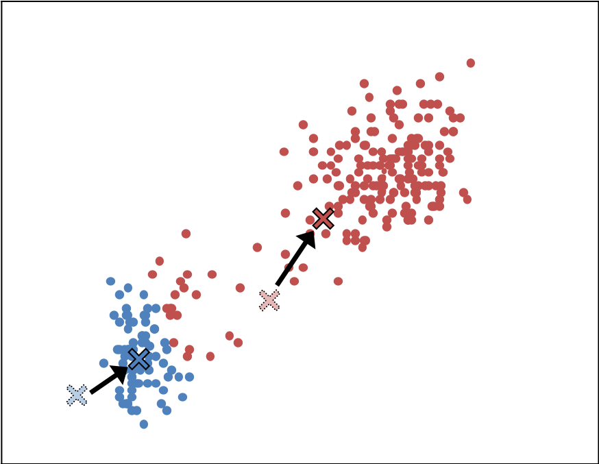
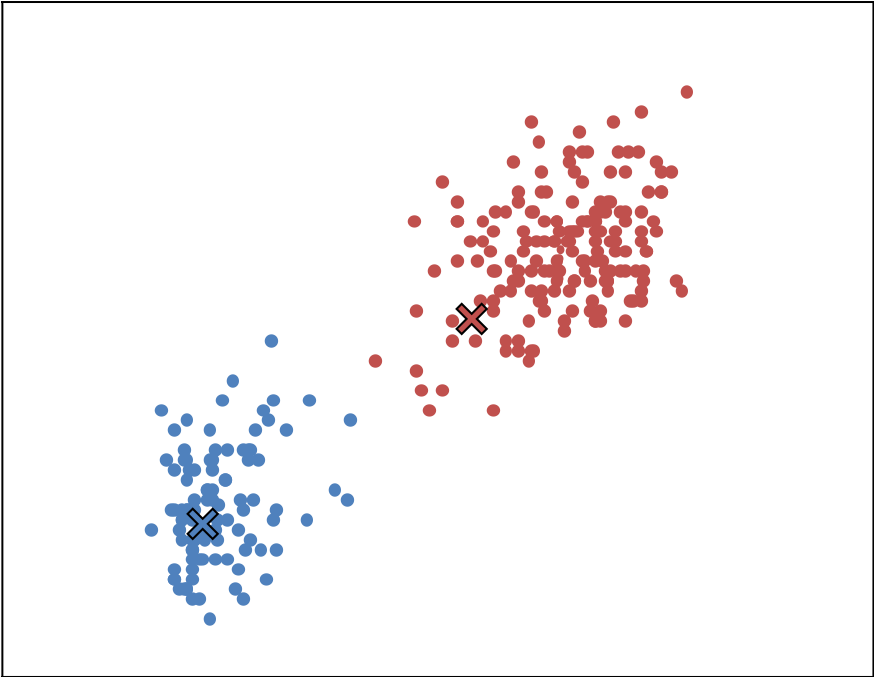
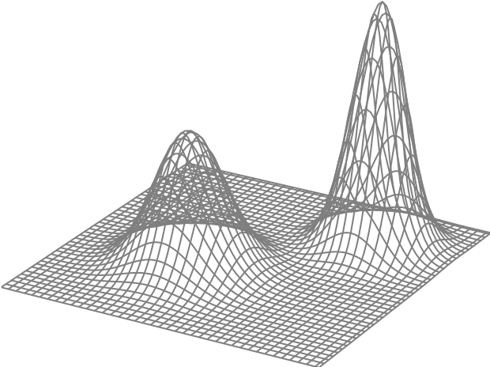
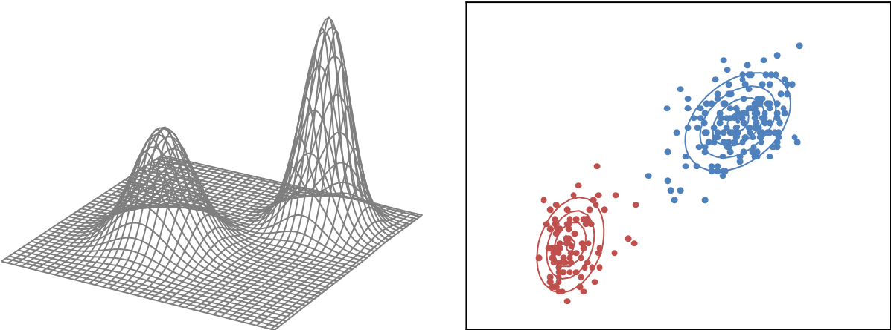

# 事前学習その１: クラスタリングの基本と2つの手法

### 教師なし学習
回帰と識別では「このような入力のときに，こんな出力」という形で問題が与えられていました．回帰の場合には出力は「値（連続的な数値）」で，識別の場合には出力は「クラス（離散的な数値）」でした．このような「入力・出力」の組でデータが与えられる問題を **教師あり学習** と呼びます．一方，入力データのみが与えられて，出力がない問題は **教師なし学習** と呼ばれます．

出力がない問題，というのをイメージしづらいかもしれません．例を見てみましょう．

識別の問題では◯と●などのラベルがついていました．上の図のデータにはそのようなラベルはありません．それでも人間が見れば，２つのかたまりがあるように見えますよね．このように，ラベルがついていないデータをいくつかのかたまりに分けることで，どのようなデータなのかを解析し，データについて深く知り，そしてそれを活かすことができます．「ラベルがついていないデータをいくつかのかたまりに分ける」のがクラスタリングです．

***
### *k*-平均法

クラスタリングのための手法にも色々とありますが，ここでは *k*-平均法 (*k*-means method)と呼ばれる手法を紹介します．詳しい数式についてはまた各自で調べてもらうことにして，基本的な考え方は以下の通りです．

1. 各クラスタの中心をどこかに「仮定」する．

1. 各データ点がどのクラスタに所属するかを決める．その際，一番近い中心位置をもつクラスタに所属すると考える．

1. 各クラスタに所属するデータ点が決まったら，それらの平均の位置を計算する．クラスタの中心は平均の位置にあるのが自然だろうから，ステップ「1.」で「仮定」したクラスタの中心をその平均位置に設定し直す．

1. 設定しなおされた各クラスタの中心を用いて，ステップ「2.」に戻ってクラスタの割り当てを繰り返す．

このような簡単な操作を繰り返すだけで，ラベルがついていないデータをいくつかのかたまりに分けることができます．

問題は「何個のクラスタに分けるか」です．このあたりは回帰の際に過学習や正則化について説明したときと同じで，基本的には人間が決める必要があります．何個くらいのクラスタに分かれるはず，という事前知識があればそれを使うのがいいでしょう．もしくは，数理的な手法を使ってクラスタ数を決める方法もあります．クラスタリングの手法に慣れてきたら，こういった点についても注意を払ってみてください．

***
### 混合ガウスモデルによるクラスタリング

確率的な観点からクラスタリングをする方法もあります．それが **混合ガウスモデル** というものを用いた方法です．数学的な側面はかなり高度になるので今は気にしないことにしますが，考え方そのものはそれほど難しくありません．

回帰や識別の際，基本的な考え方は「関数をパラメータで表現しておき，そのパラメータを調節すること」だと説明しました．クラスタリングの場合には出力がないため，いわゆる「関数」とは違うのではないか，と思われるかもしれません．でも，確率の考え方を導入すると自然と「関数とパラメータ」という道具が出てきます．

基本的な考え方は以下の通りです．

- 「確率が高いところ」からはデータがたくさん発生しやすいはずで，つまり訓練データが密集しているはず．
- 「確率が低いところ」には，訓練データはあまり存在しないはず．

そこでまず「データが生成する確率分布」を考えることにします（連続確率変数の場合には確率密度関数を扱うべきですが，ここでは確率分布と言ってしまいます．確率の議論に詳しい人は適当に読み替えてください）．確率分布は「関数」ですよね．こういう値（入力）が出現する確率（出力）がどのくらいか，を表す関数が確率分布です．続いてこの確率分布，つまり関数をパラメータを使って表現します．そして，訓練データの密集しているところが「確率の高いところ」になるように，その関数のパラメータを調整します．こう考えれば，関数をパラメータで表現して，そのパラメータを調節する，という，回帰や識別のときにやっていたことと同じ感じですよね．

混合ガウスモデルの場合には，ガウス分布（正規分布）を考えて，そのピークの位置（平均ベクトル）と広がり具合（分散共分散行列）をパラメータとして調整します．イメージとしては下のような図です．

そしてパラメータを調整していくと，下のような図が得られます．

各クラスタに対してそれぞれ確率分布（確率の等高線）が得られますから，データの値（入力）を決めると，それぞれのクラスタから発生したと仮定した場合の確率を計算できます．よって，各データ点に対してクラスタごとの確率を計算して，確率が一番大きなクラスタに所属している，と考えることによってクラスタリングが完了します．

*k*-平均法ではクラスタの中心位置のみを考えていましたが，混合ガウスモデルを用いた方法では中心と広がり具合まで考えていること，また確率の計算までおこなえること，などの違いがあります．混合ガウスモデルを用いた方が解析に時間がかかりますが，そのぶん，高度な解析を実行できます．

***
### 発展を見据えた補足事項

いくつかコメントを書いておきます．まず混合ガウスモデルを用いたクラスタリング手法は，**EMアルゴリズム** と呼ばれる方法に基づいて導出されます．EMアルゴリズムは非常に強力で広く使われている，アルゴリズムというよりは考え方に近いようなものです．何の気なしに使っていたアルゴリズムも，実はEMアルゴリズムに基づいて導出されていた，という場合もよくあります．

ちなみに *k*-平均法は混合ガウスモデルと密接な関係があります．確率分布の広がり具合（分散共分散行列）にいくつかの仮定をすることで，混合ガウスモデルにもとづくクラスタリングが *k*-平均法と一致することを示せます．逆に言えば， *k*-平均法を確率的な観点から見直すことで，より柔軟な混合ガウスモデルにつながっていく，と考えることもできるでしょう．

一見すると確率とは関係なさそうな手法を確率的な観点から見直してみることで，新しい手法につながることもよくあります（最小二乗法を確率的な観点から見直して，ベイズの手法と組み合わせるとどうなるでしょうか？）．データマイニングや機械学習には本当に色々な手法があって，乱立，ばらばら，という印象もあるかもしれませんが，実は確率や統計の視点から見直してみると本質は同じだったりします．慣れてきたら，数理的な奥深いところまで興味をもってみてください．

***
### 解析するデータセット

あとは演習で，となるのですが，ここでは識別問題で扱ったのと同じ [iris data（外部リンク）](https://archive.ics.uci.edu/ml/datasets/Iris) を使うことにします．irisデータセットには本来はラベルがついていますが，ラベルがついていなかった，と考えればクラスタリングの演習にはちょうどいい題材ですし，逆に元データについているラベルをクラスタリングの正解だと思うことで，手法についての理解を深めることもできます．

***
[>> クラスタリングのトップページに戻る](./README.md)
***
 &nbsp; Jun Ohkubo
