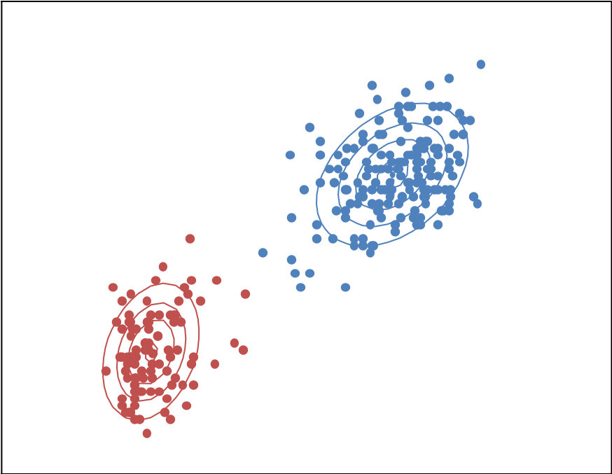
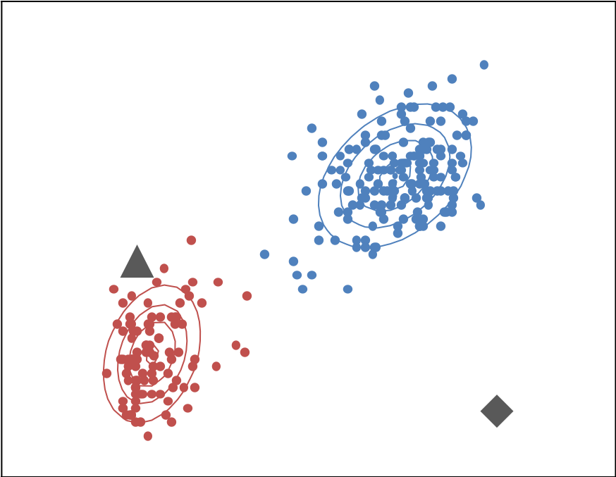

# 事前学習その２: 確率的な側面の応用

### 異常なデータを検知する

*k*-平均法ではクラスタの中心位置までしか求めることができませんでしたが，混合ガウスモデルを用いることで，各データ点がそのクラスタからどのくらいの確率で生成しうるか，ということまで計算できるようになりました．ここではその確率的な議論を応用するひとつの例として，異常なデータを検知する，という仕事を考えてみます．

データ [`iris_with_outlier.csv`](./iris_with_outlier.csv) を眺めてみてください（別タブなどで）．このどこかに，こちらで勝手に用意したおかしなデータを紛れ込ませておきました．どのデータがおかしいか，わかるでしょうか？

「正常なデータ」と「異常なデータ」が存在するのであれば，「正常」と「異常」という２つのラベルをつけておけば，識別問題として扱うことができそうです．教師あり学習，ですね．

しかし，異常なデータというのは「異常」なわけですから滅多に生じません．滅多に生じないデータを集める，というのはなかなか難しいものです．データがないとデータマイニングも機械学習もできません．データが命，ですから．

それでは，どのようにして異常なデータを検知すればいいでしょうか？

そこで，確率まで計算できる，という混合ガウスモデルの性質を利用します．つまり，正常な状態で手元にあるデータ（今の場合にはデータ [`iris.csv`](./iris.csv) を正常なものだと考えます）を使ってクラスタリングをしておくことで，正常なデータを生み出す確率分布のモデルを作ることができます．

異常なデータというのは「発生しづらい」わけですから，正常なデータから作った確率分布にもとづいて確率を計算すると，その確率が非常に小さくなるはずです．

図で考えてみましょう．

これに対して確率分布を計算します．

そして新しくやってきたデータが２つあったとして，それぞれの確率を計算します．クラスタがいくつかありますので，各クラスタに対して確率を計算して，確率が高いほうをそのデータが発生する確率だとしましょう．

▲は赤いほうに属しているだろう，ということがわかりますが，◆はどちらの等高線からも離れていて，発生する確率は非常に小さくなります．このことから，◆は正常な状態ではなく，異常なデータの可能性が高いと言えるでしょう．

このような問題は **異常値検知** と呼ばれ，非常に幅広く研究されています．ここで紹介した方法は非常に素朴なものです．ただ，考え方の基本はこんな感じですので，利用の際にはきちんと手法について調べつつ，データに適した方法を選択してください．

***
[>> クラスタリングのトップページに戻る](./README.md)
***
&copy; 2019 &nbsp; Jun Ohkubo
